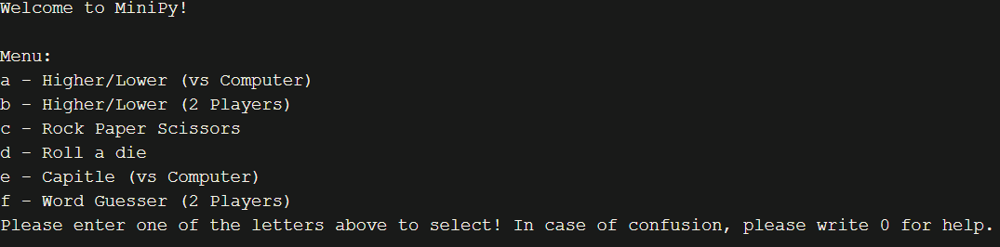
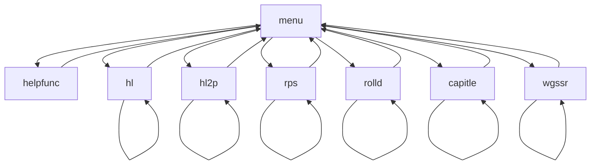

# Minipy
A collection of terminal minigames written in Python.

## Try it out: https://pyterm.hackclub.com/rgbhsl/minipy

### Features: 
- 3 games with a computer opponent
- 2 in-person multiplayer games
- Die roll/random number generator
- Help feature

All the games are entirely terminal based. Gameplay is based on simple, guided input to make it easier for the player(s).

**Program layout:**

### Acknowledgements:
- I took ideas and guidance on bugs from various websites online. 
- The idea to make multiplayer games was suggested by WinWon23.

The code is otherwise fully original and written by me. **No AI was used to write it.**

